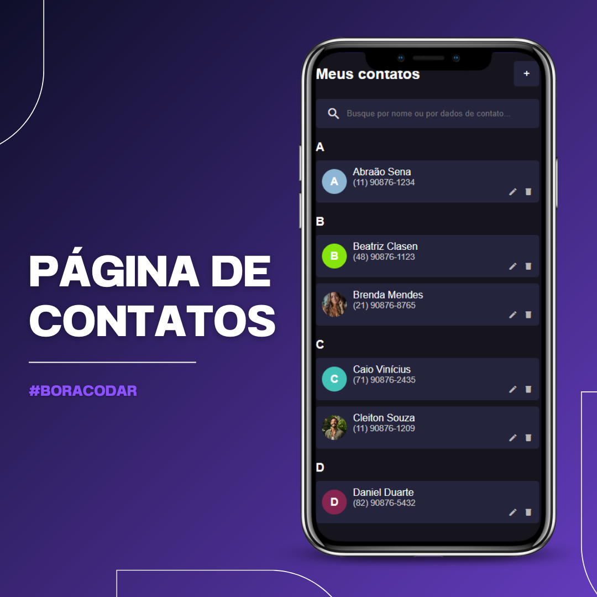

# My Contact List

 

## Descrição

**My Contact List** é uma aplicação simples para gerenciamento de contatos, permitindo que os usuários adicionem, editem e removam contatos de maneira fácil. A interface é amigável e intuitiva, perfeita para quem deseja organizar suas informações de contato de forma eficiente.

## Funcionalidades

- Adicionar novos contatos com nome, telefone e URL da imagem de perfil.
- Editar informações de contatos existentes, como nome e telefone.
- Remover contatos da lista.
- Visualizar contatos em grupos, organizados pela letra inicial do nome.
- Exibir uma imagem de perfil para cada contato, com um design responsivo e colorido.

## Tecnologias Utilizadas

- **JavaScript**: Linguagem de programação utilizada para implementar a lógica da aplicação.
- **HTML5**: Estrutura básica da aplicação.
- **CSS3**: Estilização da interface, com foco em responsividade e estética.
- **SCSS**: SASS (Syntactically Awesome Style Sheets) para estilização avançada e organização do CSS.

## Layout 

- Você pode visualizar o layout de inspiração desse projeto através [DESSE LINK](<https://www.figma.com/file/LP4Lg6sFcaWwo1PppLVdLK/%23boraCodar---Desafio-16-(Community)?t=rmR9vBCQgACsAdIZ-6>). É necessário ter conta no [Figma](https://figma.com) para acessá-lo.